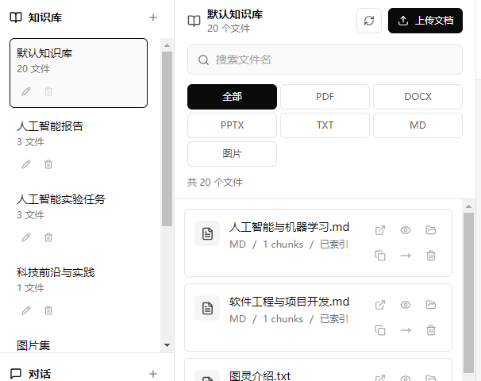
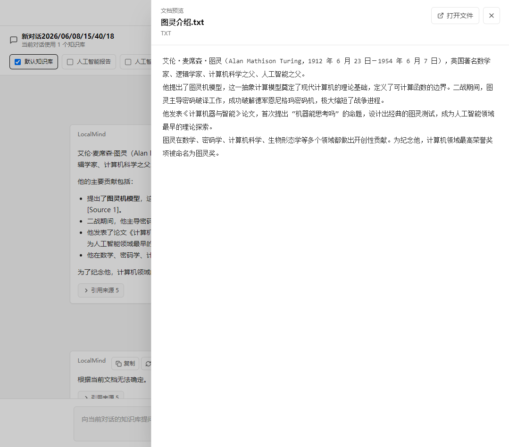
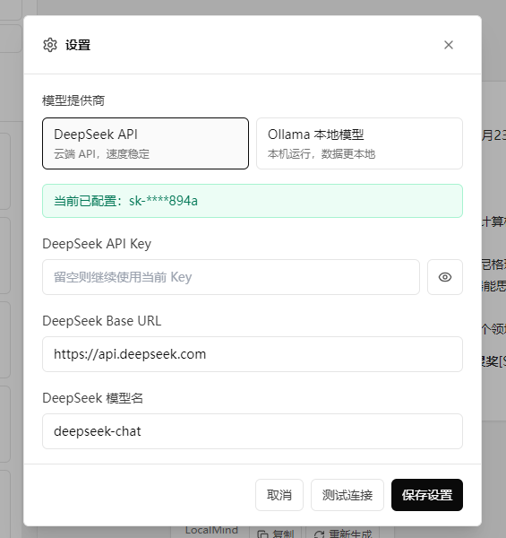

# LocalMind

LocalMind is a local-first AI knowledge base desktop application. It helps you
import documents, organize them into multiple knowledge bases, search across
local content, and ask questions with cited sources.

The app is built with Electron + React on the desktop side and FastAPI on the
local backend side. LocalMind keeps user documents, OCR text, vector indexes,
settings, and chat history on the user's own computer.

> LocalMind is currently an MVP for learning, personal research, and local
> knowledge-base experiments. It is not yet intended for enterprise or
> high-security production use.

## Features

- Multi-knowledge-base management
  - Create, rename, and delete knowledge bases.
  - A document can belong to multiple knowledge bases.
  - A conversation can use one or more knowledge bases.

- Multi-conversation chat
  - Create, rename, and delete conversations.
  - Persist chat history locally.
  - Use recent chat history for multi-turn context memory.

- Document import
  - PDF
  - DOCX
  - PPTX
  - TXT
  - Markdown
  - Images: PNG, JPG, JPEG, BMP, WEBP

- Document preview
  - PDF preview
  - DOCX text preview
  - PPTX slide text preview
  - TXT / MD text preview
  - Image preview with OCR text

- Image OCR import
  - Extract text from images with local OCR.
  - Store the original image copy.
  - Index OCR text into the knowledge base.
  - Show OCR sources in answer citations.

- Retrieval and RAG
  - ChromaDB vector search
  - Hybrid Search: vector retrieval + BM25 keyword retrieval + RRF ranking
  - Knowledge-base scoped retrieval
  - Source cards with file name, page or slide, chunk index, score, and preview text

- Model providers
  - DeepSeek API
  - Ollama local models
  - Provider selection from the Settings dialog
  - Connection testing for DeepSeek and Ollama

- Windows desktop experience
  - Electron desktop client
  - Local FastAPI backend launched with the desktop app
  - Windows packaging with PyInstaller and Electron Builder

## Tech Stack

### Desktop / Frontend

- Electron
- React
- TypeScript
- Vite
- Tailwind CSS
- axios
- react-markdown
- lucide-react

### Backend

- Python 3.10
- FastAPI
- Uvicorn
- ChromaDB
- PyPDF
- python-docx
- python-pptx
- RapidOCR
- rank-bm25
- jieba
- httpx

### AI / Retrieval

- DeepSeek API
- Ollama local HTTP API
- ChromaDB vector database
- BM25 keyword retrieval
- Reciprocal Rank Fusion

### Packaging

- PyInstaller
- Electron Builder

## Project Structure

```text
LocalMind_project/
  backend/
    app/
      api/
        routes/              FastAPI route modules
      core/                  backend configuration
      schemas/               Pydantic request and response schemas
      services/              parsing, storage, OCR, retrieval, LLM, settings
      main.py                FastAPI app entry
    .env.example             safe backend environment example
    requirements.txt         backend dependencies
    build_backend.ps1        PyInstaller backend build script
    desktop_server.py        packaged backend entry

  frontend/
    electron/                Electron main/preload scripts
    src/
      api/                   axios API wrappers
      components/            React UI components
      hooks/                 frontend state hooks
      types/                 TypeScript types
    package.json             frontend scripts and Electron Builder config

  screenshots/               screenshot placeholders for GitHub
  package.json               root dev and packaging scripts
  README.md
  LICENSE
```

## Requirements

- Windows 10 or later
- Python 3.10
- Node.js and npm
- Optional: DeepSeek API Key
- Optional: Ollama, if you want to use local models

LocalMind is developed and packaged primarily for Windows.

## Installation and Development

### 1. Clone the Repository

```powershell
git clone https://github.com/WoodenCatter/LocalMind.git
cd LocalMind
```

### 2. Backend Setup

```powershell
cd backend
python -m venv .venv
.\.venv\Scripts\Activate.ps1
pip install -r requirements.txt
```

Create a local `.env` file if you want to configure the backend manually:

```powershell
copy .env.example .env
```

Example:

```env
DEEPSEEK_API_KEY=
DEEPSEEK_API_BASE=https://api.deepseek.com
DEEPSEEK_MODEL=deepseek-chat
```

Run the backend:

```powershell
uvicorn app.main:app --reload --host 127.0.0.1 --port 8000
```

Backend health check:

```text
http://127.0.0.1:8000/health
```

API docs:

```text
http://127.0.0.1:8000/docs
```

### 3. Frontend Setup

Open another terminal:

```powershell
cd frontend
npm.cmd install
npm.cmd run dev
```

This starts the Vite dev server and opens the Electron desktop window.

### 4. One-Command Development

After backend and frontend dependencies are installed, you can start both from
the project root:

```powershell
npm.cmd run dev
```

This starts:

- FastAPI backend on `http://127.0.0.1:8000`
- Electron + React frontend through Vite on `http://127.0.0.1:5173`

Separate scripts are also available:

```powershell
npm.cmd run dev:backend
npm.cmd run dev:frontend
```

## Model Configuration

Open LocalMind and go to:

```text
Settings
```

You can choose either:

- DeepSeek API
- Ollama local model

### DeepSeek

For DeepSeek, configure:

- API Key
- API Base URL
- Model name

Default values:

```text
API Base: https://api.deepseek.com
Model: deepseek-chat
```

The real API Key is stored only on the local machine. It is not written into the
frontend source code or committed to GitHub.

## Ollama Usage

LocalMind can use Ollama as a local LLM provider.

### 1. Install Ollama

Download and install Ollama from:

```text
https://ollama.com
```

After installation, confirm that the command is available:

```powershell
ollama --version
```

### 2. Pull a Model

Recommended models:

```powershell
ollama pull qwen2.5:7b
```

Other possible choices:

```powershell
ollama pull qwen2.5:3b
ollama pull llama3.1:8b
ollama pull deepseek-r1:7b
```

### 3. Configure LocalMind

In LocalMind Settings:

```text
Provider: Ollama
Base URL: http://localhost:11434
Model: qwen2.5:7b
```

Click "Test Connection" to confirm that the Ollama service is running and the
selected model exists.

If the model is missing, run:

```powershell
ollama pull model-name
```

Ollama models are managed by Ollama itself. You do not need to copy model files
into the LocalMind project folder.

## Windows Packaging

LocalMind uses a two-process architecture:

```text
Electron desktop app
  - opens the React UI
  - launches the packaged FastAPI backend process

FastAPI backend
  - runs locally on 127.0.0.1:8000
  - handles document import, OCR, indexing, retrieval, settings, and LLM calls
```

Electron security settings:

```text
nodeIntegration: false
contextIsolation: true
sandbox: true
```

### Build Backend Executable

From the project root:

```powershell
npm.cmd run build:backend
```

Output:

```text
backend/dist/localmind-backend.exe
```

### Create an Unpacked Windows App

```powershell
npm.cmd run package:win
```

Output:

```text
frontend/release/win-unpacked/
```

You can zip this folder and publish it as a GitHub Release asset, for example:

```text
LocalMind-v0.2.0-win-x64.zip
```

### Create a Windows Installer

```powershell
npm.cmd run dist:win
```

This uses Electron Builder to create a Windows installer.

## Data Storage

### Development Mode

Generated local data is stored under `backend/`:

```text
backend/uploads/
backend/extracted_text/
backend/chunks/
backend/chroma_db/
backend/data/
backend/.env
```

### Packaged Windows App

Runtime data is stored under:

```text
%APPDATA%\LocalMind\backend/
  uploads/
  extracted_text/
  chunks/
  chroma_db/
  data/
  .env
```

Examples:

```text
%APPDATA%\LocalMind\backend\data\chat_history.json
%APPDATA%\LocalMind\backend\data\knowledge_base_state.json
%APPDATA%\LocalMind\backend\.env
```

LocalMind keeps its own managed copy of imported files in `uploads/`. Opening a
document from LocalMind opens this managed copy, so moving, renaming, or deleting
the original file outside LocalMind does not break the knowledge base.

LocalMind does not upload documents, OCR text, vector indexes, settings, or chat
history to a cloud service by itself.

## Supported File Types

| Type | Import | Preview | Notes |
| --- | --- | --- | --- |
| PDF | Yes | Yes | Basic PDF preview |
| DOCX | Yes | Yes | Text preview |
| PPTX | Yes | Yes | Slide text preview |
| TXT | Yes | Yes | Text preview |
| MD | Yes | Yes | Text preview |
| PNG | Yes | Yes | OCR text indexed |
| JPG / JPEG | Yes | Yes | OCR text indexed |
| BMP | Yes | Yes | OCR text indexed |
| WEBP | Yes | Yes | OCR text indexed |

Not supported yet:

- `.doc`
- `.ppt`
- Excel files
- Web page import
- Precise PDF page jumping
- Built-in rich Word/PPT rendering

## Screenshots

Place screenshots in:

```text
screenshots/
```

Suggested files:

```text
screenshots/main-window.png
screenshots/knowledge-bases.png
screenshots/chat-with-sources.png
screenshots/document-preview.png
screenshots/settings.png
```

Preview placeholders:







## Roadmap

- Streaming AI responses
- Better source page navigation and highlighting
- More robust document preview
- Excel import
- Web page import
- Backup and restore for local knowledge bases
- Improved retrieval evaluation and embedding quality
- Better release workflow and signed Windows installer
- Optional model-provider expansion

## GitHub Release Checklist

Before publishing a release:

- Confirm no real `.env` file is committed.
- Confirm no real API Key appears in committed files.
- Confirm user documents are not committed.
- Confirm `backend/uploads/`, `backend/extracted_text/`, `backend/chunks/`,
  `backend/chroma_db/`, and `backend/data/` are not committed.
- Confirm `frontend/release/`, `frontend/dist/`, `frontend/dist-electron/`,
  `backend/build/`, and `backend/dist/` are not committed.
- Confirm `node_modules/`, `.venv/`, `__pycache__/`, and `*.pyc` are ignored.
- Update version numbers in `package.json` files.
- Run frontend build:

```powershell
cd frontend
npm.cmd run build
```

- Run backend syntax check:

```powershell
cd backend
python -m compileall -q app
```

- Build release package:

```powershell
npm.cmd run package:win
```

## License

MIT License.

LocalMind is intended for learning, personal knowledge-base management, and
local AI application experiments.
