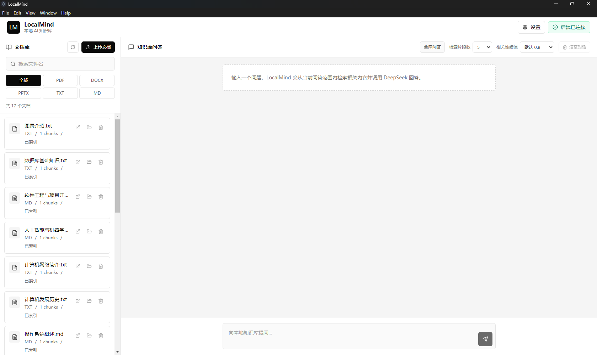
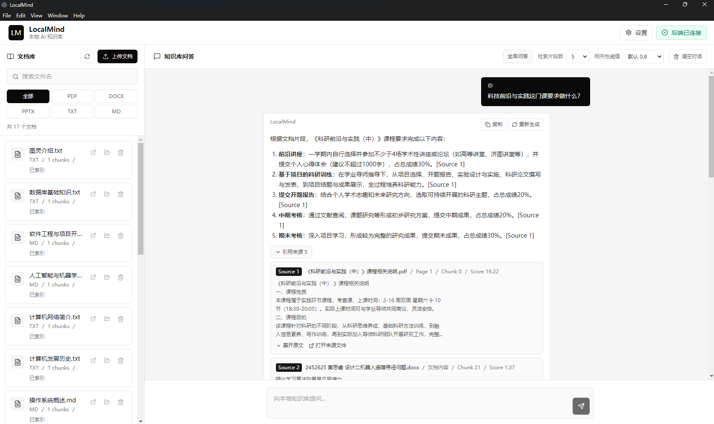

# LocalMind

LocalMind is a local-first AI knowledge base desktop app for importing personal
documents, searching them with vector retrieval, and asking questions with cited
sources. It is built as an Electron desktop client plus a local FastAPI backend.

This project is currently an MVP for learning and personal knowledge-base use.
It is not intended for production, enterprise deployment, or handling highly
sensitive data without further security review.

## Core Features

- Import PDF, DOCX, PPTX, TXT, and Markdown files.
- Extract text, split it into chunks, and index chunks into ChromaDB.
- Ask questions across the whole library or selected documents.
- Generate answers with DeepSeek API based on retrieved document context.
- Show cited source cards with file name, page or slide label, chunk index,
  score, and expandable text previews.
- Search, filter, upload, delete, open, and reveal imported document copies.
- Configure DeepSeek API Key from the desktop settings dialog.
- Render AI answers as Markdown.
- Copy and regenerate AI answers.
- Persist the current chat history locally between app launches.
- Package the app on Windows with Electron Builder and PyInstaller.

## Tech Stack

- Desktop: Electron
- Frontend: React, TypeScript, Vite, Tailwind CSS, axios
- Backend: Python 3.10, FastAPI
- AI: DeepSeek API
- Vector database: ChromaDB
- Windows packaging: PyInstaller, Electron Builder

## Screenshots

Put GitHub screenshots in:

```text
screenshots/
```

Suggested screenshot files:

```text
screenshots/main-window.png
screenshots/document-library.png
screenshots/chat-with-sources.png
screenshots/settings.png
```

Preview placeholders:




## Project Structure

```text
LocalMind_project/
  backend/
    app/
      api/routes/       FastAPI route modules
      core/             backend configuration
      schemas/          Pydantic request/response schemas
      services/         document parsing, storage, RAG, settings, history
      main.py           FastAPI app entry
    .env.example        safe environment variable example
    requirements.txt    backend runtime dependencies
    build_backend.ps1   PyInstaller backend build script
    desktop_server.py   packaged backend entry
  frontend/
    electron/           Electron main process
    src/
      api/              axios API wrappers
      components/       React UI components
      hooks/            frontend state hooks
      types/            TypeScript types
    package.json        frontend scripts and Electron Builder config
  screenshots/          README screenshot placeholders
  package.json          root development and packaging scripts
  README.md
  LICENSE
```

## Requirements

- Windows 10 or later
- Python 3.10
- Node.js and npm
- DeepSeek API Key

The project was developed on Windows. Other platforms may need small changes,
especially around packaging and file opening behavior.

## Backend Setup

```powershell
cd D:\LocalMind_project\backend
python -m venv .venv
.\.venv\Scripts\Activate.ps1
pip install -r requirements.txt
```

Create `backend/.env` from `backend/.env.example` if you want to configure the
backend manually:

```text
DEEPSEEK_API_KEY=
DEEPSEEK_API_BASE=https://api.deepseek.com
DEEPSEEK_MODEL=deepseek-chat
```

Run the backend:

```powershell
cd D:\LocalMind_project\backend
.\.venv\Scripts\Activate.ps1
uvicorn app.main:app --reload --host 127.0.0.1 --port 8000
```

Health check and API docs:

```text
http://127.0.0.1:8000/health
http://127.0.0.1:8000/docs
```

## Frontend / Electron Setup

```powershell
cd D:\LocalMind_project\frontend
npm.cmd install
npm.cmd run dev
```

This starts the Vite dev server and opens the Electron desktop window.

## One-Command Development

After installing backend and frontend dependencies, run from the project root:

```powershell
cd D:\LocalMind_project
npm.cmd run dev
```

This starts both:

- FastAPI backend on `http://127.0.0.1:8000`
- Electron + React frontend through Vite on `http://127.0.0.1:5173`

Separate commands are also available:

```powershell
npm.cmd run dev:backend
npm.cmd run dev:frontend
```

## Windows Packaging

LocalMind uses a two-process desktop architecture:

```text
Electron main process
  - opens the React desktop UI
  - starts a local FastAPI backend process on 127.0.0.1:8000

React renderer
  - calls http://127.0.0.1:8000 through axios
```

The React renderer does not get direct Node.js access. Electron keeps:

```text
nodeIntegration: false
contextIsolation: true
sandbox: true
```

Build the backend executable:

```powershell
cd D:\LocalMind_project
npm.cmd run build:backend
```

Create an unpacked Windows app folder for local testing:

```powershell
cd D:\LocalMind_project
npm.cmd run package:win
```

Create an NSIS installer:

```powershell
cd D:\LocalMind_project
npm.cmd run dist:win
```

The backend is built as:

```text
backend/dist/localmind-backend.exe
```

Electron Builder copies it into the packaged app resources:

```text
resources/backend/localmind-backend.exe
```

When the packaged app starts, Electron launches this local backend process.

## DeepSeek API Key

In normal desktop usage, set the API Key from:

```text
LocalMind -> Settings
```

The app does not store the real API Key in frontend code or in the app bundle.
It saves the key locally on the user's computer.

Development fallback:

```text
backend/.env
```

Packaged Windows app:

```text
%APPDATA%\LocalMind\backend\.env
```

Do not commit `.env` or real API keys to GitHub.

## Supported File Formats

- `.pdf`
- `.docx`
- `.pptx`
- `.txt`
- `.md`

Not supported yet:

- `.doc`
- `.ppt`
- Excel files
- OCR for scanned PDFs or images
- Web page import

## Local Data Storage

In development, generated data is stored under `backend/`:

```text
backend/uploads/
backend/extracted_text/
backend/chunks/
backend/chroma_db/
backend/data/
backend/.env
```

In the packaged Windows app, runtime data is stored under:

```text
%APPDATA%\LocalMind\backend/
  uploads/
  extracted_text/
  chunks/
  chroma_db/
  data/
  .env
```

LocalMind keeps its own copy of every imported file in `uploads/`. Opening a
document from the app opens this managed copy, so moving, renaming, or deleting
the user's original source file does not affect the knowledge base.

Chat history is stored locally:

```text
%APPDATA%\LocalMind\backend\data\chat_history.json
```

Uploaded documents, vector data, settings, and chat history stay on the user's
computer and are not uploaded to a cloud service by LocalMind.

## Current Limits

- This is an MVP and local learning project.
- Windows packaging is unsigned and minimal.
- DeepSeek API requires the user's own API Key and may incur API costs.
- Retrieval quality is suitable for MVP usage and can be improved later with
  better embeddings and evaluation.
- No OCR, streaming output, document preview, source page jumping, account
  system, cloud sync, or auto-update yet.

## Roadmap

- Add streaming AI answers.
- Add document preview and source jumping.
- Add OCR for scanned PDFs and images.
- Improve embeddings and retrieval evaluation.
- Add import/export or backup tools for the local knowledge base.
- Polish installer and release workflow.

## GitHub Checklist

Before uploading or publishing:

- Confirm `backend/.env` is not committed.
- Confirm no real DeepSeek API Key appears in committed files.
- Confirm `backend/uploads/` does not contain user documents for upload.
- Confirm `backend/extracted_text/`, `backend/chunks/`, `backend/chroma_db/`,
  and `backend/data/` are not committed.
- Confirm chat history is not committed.
- Confirm build outputs such as `backend/build/`, `backend/dist/`,
  `frontend/dist/`, `frontend/dist-electron/`, and `frontend/release/` are not
  committed unless intentionally publishing binaries elsewhere.
- Add screenshots under `screenshots/` and check README image paths.
- Run `npm.cmd run build` in `frontend/`.
- Run `python -m compileall app desktop_server.py` in `backend/`.
